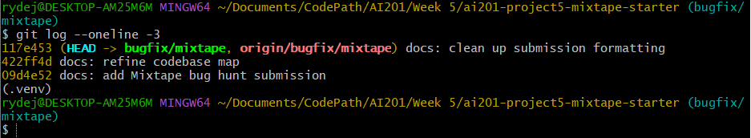

# AI201 Project 5: Mixtape Bug Hunt

## AI Usage

I used AI assistance during codebase navigation and debugging, mainly to help structure my investigation and explain suspicious code paths after I had already reproduced the failing tests. One specific use was asking AI to explain why a playlist service that queried songs correctly could still omit the newest song; I then verified the explanation by reading `services/playlist_service.py` and confirming that the return statement used `songs[:-1]`, which slices off the last result.

I also used AI to help reason about the Sunday streak bug after the failing test showed that Saturday-to-Sunday listening reset the streak. AI helped explain the meaning of Python's `datetime.weekday()` values, but I verified the actual root cause by reading the condition in `services/streak_service.py` and confirming that the Sunday check blocked the normal consecutive-day increment path. For the search duplicate issue, AI helped identify that joins can create duplicate rows when a song has multiple matching tags, but I confirmed the fix by reading `services/search_service.py`, adding `.distinct()`, and rerunning `tests/test_search.py`.

## Codebase Map

This Flask application is organized around route handlers, service modules, SQLAlchemy models, seed data, and pytest tests.

- `app.py` creates the Flask app, configures SQLAlchemy, initializes SQLAlchemy, and registers route handlers.
- `models.py` defines the main SQLAlchemy models used across the app, including users, songs, playlists, notifications, and association tables such as playlist entries and song tags.
- `seed_data.py` creates predictable local test data for users, songs, playlists, tags, listening history, and related records so the reported bugs can be reproduced consistently.
- `services/playlist_service.py` contains playlist creation and playlist retrieval logic. It is responsible for returning playlist metadata and ordered song lists.
- `services/streak_service.py` contains listening streak logic. It updates and returns a user's listening streak based on listening activity dates.
- `services/search_service.py` contains song search logic. It searches across song fields and tag relationships and returns matching song dictionaries.
- `tests/test_playlists.py` verifies playlist behavior, including whether all songs are returned and whether playlist order is preserved.
- `tests/test_streaks.py` verifies listening streak behavior, including consecutive-day updates and the Sunday edge case.
- `tests/test_search.py` verifies search behavior, including avoiding duplicate song results when a matching song has multiple tags.

### Data Flow Example: Playlist Song Retrieval

When code calls `get_playlist_songs(playlist_id)`, the function in `services/playlist_service.py` first loads the playlist by ID. If the playlist does not exist, it raises a `ValueError`. If it exists, the function queries `Song` records joined through the `playlist_entries` association table, filters rows for the requested playlist, orders the results by `playlist_entries.position`, and returns each song as a dictionary.

This means playlist order is controlled by the join table's `position` column rather than by raw insertion order or song title. The route/service pattern keeps the data retrieval logic inside the service layer, while the tests call service functions directly to verify behavior.

### Pattern Noticed

The app keeps business logic in the `services/` directory. The route layer is responsible for request handling and response formatting, while the service layer performs database queries and application-specific decisions. The tests exercise service functions directly, which means the codebase is organized so core behavior can be verified without manually driving every HTTP endpoint.

---

## Root Cause Analysis Entries

## Issue #5 — The Last Song in a Playlist Never Shows Up

### 1. Issue Number and Title

Issue #5 — The last song in a playlist never shows up.

### 2. How I Reproduced It

I reproduced this by running the existing playlist tests with:

```bash
pytest tests/test_playlists.py
```

Before the fix, `test_playlist_returns_all_songs` failed because the playlist contained 5 songs but the function returned only 4. `test_playlist_returns_songs_in_order` also failed because the expected ordered list included `Track 5`, but the actual returned list stopped before the final song.

### 3. How I Found the Root Cause

I started from the failing tests in `tests/test_playlists.py` because the failure directly named the behavior: the playlist did not return all songs. From there, I traced the tested function call to `get_playlist_songs()` in `services/playlist_service.py`.

The query itself looked correct because it joined songs through `playlist_entries`, filtered by `playlist_id`, and ordered by `playlist_entries.c.position`. The moment I was confident I had found the root cause was when I saw the final return statement used `songs[:-1]`. That meant the database query was getting the right records, but the Python list operation removed the last result before returning it.

### 4. The Root Cause

The root cause was a list slicing error in `get_playlist_songs()`. The function queried all playlist songs correctly, but then returned:

```python
return [song.to_dict() for song in songs[:-1]]
```

In Python, `songs[:-1]` means every item except the last one. This caused the newest or final-position song to always be removed from the response even though it existed in the database query result. That matches the user report exactly: adding a new song made the previously missing song appear, but the newest song became hidden.

### 5. Fix and Side-Effect Check

I changed the return statement to iterate over `songs` instead of `songs[:-1]`:

```python
return [song.to_dict() for song in songs]
```

This fixes the bug because the function now returns every song retrieved by the ordered query. As a side-effect check, I reran:

```bash
pytest tests/test_playlists.py
```

The playlist tests passed. This checked not only that the missing song returned, but also that playlist ordering still worked correctly.

**Commit:**

```text
fix: return all playlist songs
```

---

## Issue #1 — My Listening Streak Keeps Resetting

### 1. Issue Number and Title

Issue #1 — My listening streak keeps resetting.

### 2. How I Reproduced It

I reproduced this by running:

```bash
pytest tests/test_streaks.py
```

Before the fix, `test_streak_increments_on_sunday` failed. The test listened on Saturday and then Sunday. The expected result was that the streak would increment from 1 to 2, but the actual result stayed/reset to 1.

### 3. How I Found the Root Cause

I followed the failing test from `tests/test_streaks.py` into `services/streak_service.py`, specifically the function that updates the listening streak. I looked at how the function calculated `days_since_last` and then checked the branch that handles consecutive-day listening.

The key moment was noticing that the code only incremented the streak when this condition was true:

```python
days_since_last == 1 and today.weekday() != 6
```

That made Sunday the special failing case, which matched the issue report.

### 4. The Root Cause

The root cause was an unnecessary Sunday exclusion in the consecutive-day streak condition. Python's `weekday()` returns `6` for Sunday, and the code explicitly prevented the consecutive-day increment path from running on Sundays. That meant a valid Saturday-to-Sunday listening sequence was treated differently from other consecutive-day sequences, causing the streak to reset or fail to increment even though the user had listened on consecutive calendar days.

The correct behavior requires using the date difference, not excluding a specific day of the week. If `days_since_last == 1`, then the user listened on consecutive calendar days regardless of whether the current day is Sunday.

### 5. Fix and Side-Effect Check

I removed the `today.weekday() != 6` condition so that any `days_since_last == 1` case increments the streak, including Sunday.

The buggy logic was:

```python
elif days_since_last == 1 and today.weekday() != 6:
```

The fixed logic is:

```python
elif days_since_last == 1:
```

As a side-effect check, I reran:

```bash
pytest tests/test_streaks.py
```

All streak tests passed. This verified the Sunday case and the other streak behavior covered by the test file, including normal consecutive-day and non-consecutive-day behavior.

**Commit:**

```text
fix: increment listening streak on Sunday
```

---

## Issue #3 — The Same Song Keeps Showing Up Twice in Search

### 1. Issue Number and Title

Issue #3 — The same song keeps showing up twice in search.

### 2. How I Reproduced It

I reproduced this by running:

```bash
pytest tests/test_search.py
```

Before the fix, the search tests showed that duplicate results could appear when a song matched through more than one joined tag path. The user-facing symptom was that a single song such as an “Anthem” result could appear multiple times even though it represented the same song record.

### 3. How I Found the Root Cause

I traced the failing search behavior from `tests/test_search.py` into `services/search_service.py`. I looked at how the query was built and noticed that it used an outer join between `Song` and `song_tags`.

That made the duplicate behavior conditional: songs without multiple matching tag rows would appear once, but songs with multiple joined tag rows could appear multiple times. The moment I was confident was when I saw the query returned `Song` rows from a join without deduplicating the base song records.

### 4. The Root Cause

The root cause was that the search query joined songs to tag rows but did not call `.distinct()` on the song results. SQL joins can produce more than one row for the same song when the song has multiple associated tag rows. Because the service converted each returned row into a song dictionary, the same song could appear multiple times in the API-style result list.

The correct behavior requires returning each matching song once, even if the song matched the search through multiple tags or joined rows.

### 5. Fix and Side-Effect Check

I added `.distinct()` to the search query after the outer join and before filtering. This keeps the tag-aware search behavior while ensuring each matching song appears only once in the returned results.

As a side-effect check, I reran:

```bash
pytest tests/test_search.py
```

All search tests passed. I also reran the full suite with:

```bash
pytest tests/
```

The full test suite passed, confirming playlist, streak, and search behavior all passed together.

**Commit:**

```text
fix: deduplicate song search results
```

---

## Test Summary

After all three fixes, I ran:

```bash
pytest tests/
```

Result:

```text
13 passed
```

## Git Log

Run this command on the `bugfix/mixtape` branch and include the output or screenshot in the submission:

```bash
git log --oneline
```



Current relevant bug-fix commit history:

```text
e144a36 fix: deduplicate song search results
b806186 fix: increment listening streak on Sunday
a570c9e fix: return all playlist songs
```

The screenshot above shows the commit history on the `bugfix/mixtape` branch, including the separate `fix:` commits required for the three completed bug fixes.

## Submission Notes

The project should be submitted using the branch URL, not the plain repository URL:

```text
https://github.com/ryandej/ai201-project5-mixtape-starter/tree/bugfix/mixtape
```
